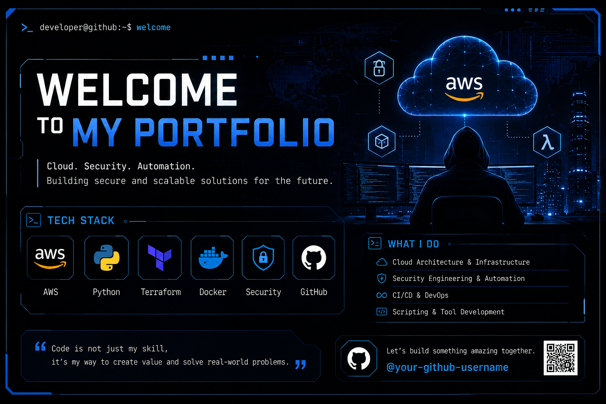

# 
# AWS Master Portfolio

## 概要
AWS・インフラ・DevOps・セキュリティ・フロントエンドなど、幅広い技術領域を実践的に学び、成果物としてまとめたポートフォリオです。実際の業務や現場課題を意識し、設計・構築・自動化・運用まで一貫して取り組んでいます。

## 特徴・アピールポイント
- AWSを中心としたクラウドインフラの設計・IaC（Terraform）による自動化
- KubernetesやCI/CD、セキュリティ自動化など最新技術の実践
- 各テーマごとに成果物・学習記録・工夫点をドキュメント化
- フロントエンド（React）や自作ツールも含めた幅広いアウトプット

## ディレクトリ構成（主要サブプロジェクト）

- `projects/01-basic-infrastructure/` … AWS基本インフラ構築（Terraform）
- `projects/02-kubernetes-basic/` … Kubernetes基礎演習
- `projects/03-aws-kubernetes-practice/` … AWS上でのKubernetes実践
- `projects/04-enterprise-landing-zone/` … エンタープライズ向けLanding Zone設計
- `projects/05-hybrid-network/` … ハイブリッドネットワーク構成例
- `projects/06-security/` … セキュリティ自動化・GuardDuty等
- `projects/07-sso_usermanagement/` … SSO・権限管理の自動化
- `projects/08-alratConstruct/` … CloudWatchアラート設計・自動化
- `projects/09-secret-upload-prevention/` … 機密情報アップロード防止
- `projects/10-Hybrid-Cloud-Connectivity-and-Security-Automation/` … ハイブリッドクラウド自動化
- `projects/11-DevSecOps-pipeLine/` … DevSecOpsパイプライン構築
- `projects/12-mask-app/` … フロントエンド（React）アプリ開発

## サブプロジェクト一覧
- [01-basic-infrastructure](projects/01-basic-infrastructure/)
- [02-kubernetes-basic](projects/02-kubernetes-basic/)
- [03-aws-kubernetes-practice](projects/03-aws-kubernetes-practice/)
- [04-enterprise-landing-zone](projects/04-enterprise-landing-zone/)
- [05-hybrid-network](projects/05-hybrid-network/)
- [06-security](projects/06-security/)
- [07-sso_usermanagement](projects/07-sso_usermanagement/)
- [08-alratConstruct](projects/08-alratConstruct/)
- [09-secret-upload-prevention](projects/09-secret-upload-prevention/)
- [10-Hybrid-Cloud-Connectivity-and-Security-Automation](projects/10-Hybrid-Cloud-Connectivity-and-Security-Automation/)
- [11-DevSecOps-pipeLine](projects/11-DevSecOps-pipeLine/)
- [12-mask-app](projects/12-mask-app/)

---

今後、各サブプロジェクトの詳細やスクリーンショット、工夫点なども追記していきます。
