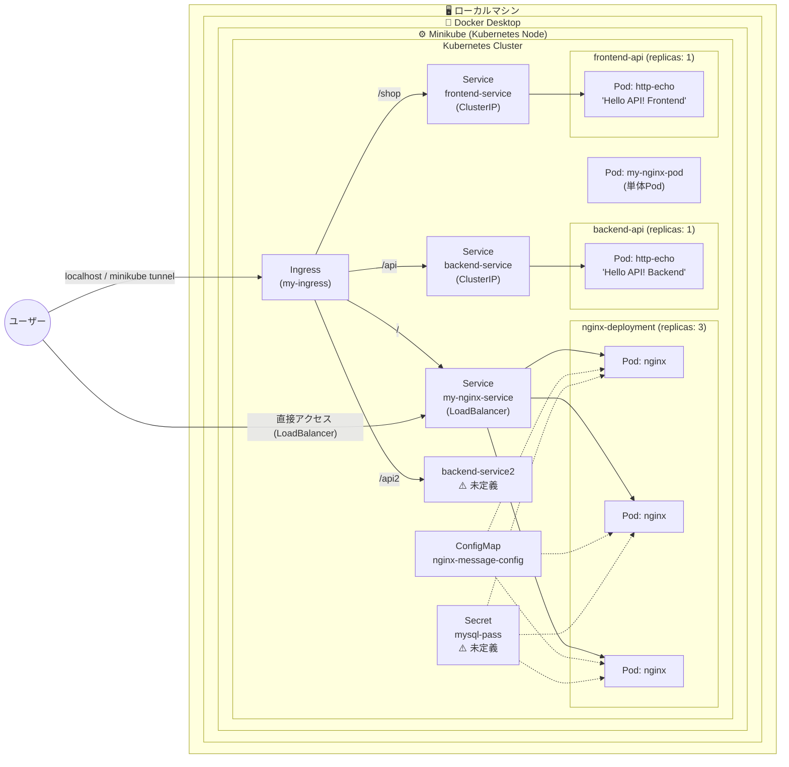

# Kubernetes 構成図

## リソース一覧

| リソース種別 | 名前 | 備考 |
|---|---|---|
| Ingress | my-ingress | パスベースルーティング |
| Deployment | nginx-deployment | replicas: 3, nginx:latest |
| Deployment | backend-api | replicas: 1, hashicorp/http-echo |
| Deployment | frontend-api | replicas: 1, hashicorp/http-echo |
| Service | my-nginx-service | type: LoadBalancer |
| Service | backend-service | type: ClusterIP |
| Service | frontend-service | type: ClusterIP |
| ConfigMap | nginx-message-config | WELCOME_TEXT 用 |
| Secret | mysql-pass | ⚠️ マニフェスト未定義 |
| Pod | my-nginx-pod | 単体Pod（Deployment管理外） |
