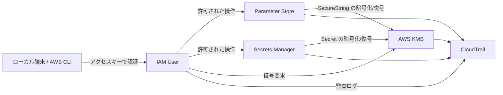

# 16 Key Management

---

> 「DB のパスワードをどこに保管するか迷って、とりあえず環境変数に直書きしていた。
> いつか漏れそうで怖いけど、ちゃんとした方法を知らない。」

> 「S3 のデータは暗号化していると思っていたけど、
> 誰でも復号できる状態だったことが後で分かった。
> "暗号化有効" と "安全に守られている" は別物だったのか…」

クラウドにおける機密情報管理は「保存する場所の選択」と「誰が復号できるか」の設計が重要です。
**AWS KMS** で暗号化キーを管理し、**Parameter Store** で設定値を、**Secrets Manager** で高機密情報（DB パスワード等）をローテーションつきで管理する、という使い分けが AWS のベストプラクティスです。
さらに **CloudTrail** と組み合わせて「誰がいつ何を取得したか」を追跡できる設計にすることで、監査にも耐えられるセキュリティ基盤になります。

本プロジェクトは、その機密情報管理の全体像を、実際に CLI で検証・比較しながら理解した学習成果です。

---

AWS のキー管理・秘密情報管理を一連で検証。
KMS・Parameter Store・Secrets Manager の使い分け、権限制御の設計判断、CloudTrail による監査を実践で確認した。

---

## 検証構成図



---

## サービス比較と使い分け

| 比較観点 | Parameter Store | Secrets Manager |
|---------|----------------|----------------|
| 用途 | 設定値・環境変数の管理 | 高機密情報（DB パスワード・API キー）|
| 暗号化 | SecureString + KMS（任意）| KMS（必須）|
| ローテーション | 手動 | 自動ローテーション可 |
| コスト | 低（スタンダードは無料）| 有料 |

---

## 検証シナリオと得た知見

### 1. 権限と復号の分離
- IAM Policy（参照権限）と KMS Key Policy（復号権限）は別々に設計する
- 「取得できるが復号できない」は設計ミスの検出ポイントになる

### 2. 暗号化の透過性
- S3・RDS・DynamoDB などはデフォルト暗号化が有効
- 通常操作では暗号化を意識しにくいが、KMS カスタマーマネージドキーを使うと「誰が復号できるか」を明示的に制御できる

### 3. アクセスキー運用の方針
- 長期アクセスキーは漏えいリスクと棚卸し負荷が高い
- 可能な限りロールベース（一時認証）に寄せる方針が妥当

### 4. 監査設計
- CloudTrail で鍵・シークレット操作を追跡できる状態が必須
- 「誰が・いつ・何を取得したか」が記録される設計を確認

---

## 検証した内容一覧

| 検証項目 | 確認内容 |
|---------|---------|
| Parameter Store | String / SecureString の登録・取得・復号可否 |
| Secrets Manager | 権限あり/なしでの取得挙動の差分 |
| KMS CLI 操作 | encrypt / decrypt コマンドの実行と確認 |
| S3 暗号化 | バケット暗号化状態・オブジェクトヘッダ確認 |
| CloudWatch Logs | KMS キー関連付け・機密情報マスク処理 |
| RDS / DynamoDB | 保存データ暗号化設定の確認 |
| RDS IAM 認証 | パスワードレス接続の動作確認 |
| CloudTrail | 参照・更新イベントの追跡確認 |

---

## ファイル構成

```
16-key-management/
├── システム構成.md          # 構成図・検証シナリオ詳細
├── 学習内容_1ページまとめ.md # 学習成果サマリー
├── 学習内容/               # 検証ごとの詳細メモ
├── 02-terraform/           # 検証環境 Terraform
└── 03-memo/                # 作業メモ・コマンド集
```

---

## 実行方法

```bash
cd 02-terraform
terraform init
terraform apply

# Parameter Store 取得（復号あり）
aws ssm get-parameter --name /app/secret --with-decryption

# Secrets Manager 取得
aws secretsmanager get-secret-value --secret-id app/db-password

# KMS 動作確認
aws kms encrypt --key-id <KEY_ID> --plaintext "test"
aws kms decrypt --ciphertext-blob <BLOB>
```
