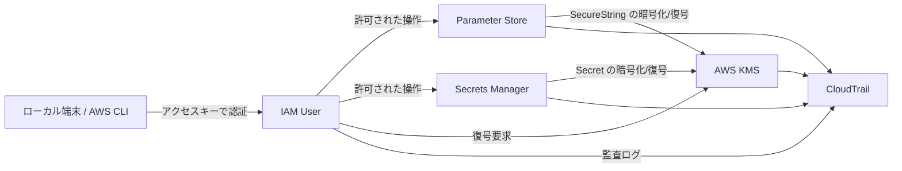

# 検証システム構成

## 目的

この検証では、AWS のキー管理と秘密情報管理をまとめて確認できる最小構成を作る。

確認したい内容は以下の通り。

- KMS による暗号化と復号の流れ
- Parameter Store での設定値管理
- Secrets Manager での機密情報管理
- IAM User のアクセスキー管理
- 権限の違いによる取得可否の差分

## 構成方針

- できるだけ小さく構成する
- 実運用に近い権限制御を入れる
- 保存先の違いと取得権限の違いを比較できるようにする

## 構成要素

- ローカル端末
  - AWS CLI で検証操作を行う
  - IAM User のアクセスキーを使う想定
- IAM
  - 検証用ユーザーとポリシーを用意する
  - Parameter Store、Secrets Manager、KMS の参照権限を制御する
- AWS KMS
  - SecureString と Secrets Manager の暗号化に使う
  - 復号権限を IAM と KMS Key Policy で制御する
- AWS Systems Manager Parameter Store
  - 一般設定値と SecureString を保存する
  - 暗号化有無の違いを確認する
- AWS Secrets Manager
  - パスワードや API キーなどの機密情報を保存する
  - ローテーションの有無を確認する
- 暗号化される追加サービス
  - S3: バケット暗号化と KMS の関係を確認する
  - RDS / Aurora: 保存データの暗号化とスナップショットの扱いを確認する
  - EBS: ボリューム暗号化と KMS の関係を確認する
  - CloudWatch Logs: ログ保護に KMS を使う流れを確認する
  - DynamoDB: テーブル暗号化とアクセス制御を確認する
- CloudTrail
  - 誰が何を取得・更新したかを追跡する

## 構成図

## 検証シナリオ

1. アクセスキー管理の確認
   - IAM User にアクセスキーを発行する
   - 有効化、無効化、削除の違いを確認する

2. Parameter Store の確認
   - 通常の文字列を保存する
   - SecureString を保存して復号結果を確認する

3. Secrets Manager の確認
   - 秘密情報を登録する
   - 取得権限がある場合とない場合の挙動を確認する

4. S3 や DB の確認
  - S3 に保存したデータが暗号化されることを確認する
  - DB の保存データ暗号化とアクセス制御を確認する

5. CloudWatch と DynamoDB の確認
  - CloudWatch Logs に保存したログが暗号化されることを確認する
  - DynamoDB のテーブル暗号化と取得権限を確認する
  -cloudwatch log はコンソールから暗号化を指定できない。

6. KMS の確認
   - 暗号化キーを使って保存・復号が行われることを確認する
   - Key Policy と IAM Policy の両方が必要になる場面を確認する

7. 監査の確認
   - CloudTrail で参照や更新の記録が追えるか確認する

## この構成で分かること

- どの情報をどこに置くべきか
- どの権限がないと取得できないか
- アクセスキー運用を続けるべきか、ロールに寄せるべきか
- Parameter Store と Secrets Manager の使い分け
- S3 や DB の暗号化設定をどう設計するか
- CloudWatch Logs と DynamoDB の暗号化をどう管理するか

## 補足

この検証では、アプリケーション本体よりも「保存先」「権限」「暗号化」「監査」の比較を優先する。
